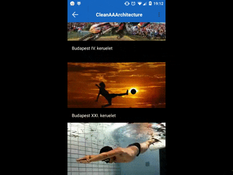

 

A project which showcases usage of AndroidAnnotions among other open source libraries.

# Features
* Model-View-Presenter architectural pattern
* AndroidAnnotations
* Connectivity aware retrofit client
* Network and database errorhandling
* Uncaught errorhandling
* Navigator to get current activity onscreen
* SnappyDB base implementation for storing everything 
* Loading toast progress
* Commons library with a lot of util classes and great 3rd party widgets  
* Robolectric tests with MockWebServer

# Libraries

## Core

### Android Annotations
* **HomePage** [Link](https://github.com/excilys/androidannotations)
* **Wiki** [Link](https://github.com/excilys/androidannotations/wiki) 
* **Cookbook** [Link](https://github.com/excilys/androidannotations/wiki/Cookbook)

Dependecy Injection, EventBinding, Threading, Resource Injection

### OkHttp
* **HomePage** [Link](http://square.github.io/okhttp/)
* **Wiki** [Link](https://github.com/square/okhttp/wiki) 

Http client

### Retrofit
* **HomePage** [Link](http://square.github.io/retrofit/)

REST client

### Gson
* **HomePage** [Link](https://code.google.com/p/google-gson/)
* **Wiki** [Link](https://sites.google.com/site/gson/gson-user-guide) 

Json serialization

### SnappyDb
* **HomePage** [Link](http://www.snappydb.com)
* **Wiki** [Link](https://github.com/nhachicha/SnappyDB) 

SharedPreferences, NoSQL database, Cache

### Picasso
* **HomePage** [Link](https://square.github.io/picasso)
* **Wiki** [Link](https://github.com/square/picasso) 

Imageloader and cacher

### Hugo
* **HomePage** [Link](https://github.com/jakeWharton/hugo)

Logger

## UI

### ExpandableLayout
* **HomePage** [Link](https://github.com/traex/ExpandableLayout/)

### Snackbar
* **HomePage** [Link](https://github.com/nispok/snackbar)

### ObservableScrollview
* **HomePage** [Link](https://github.com/ksoichiro/Android-ObservableScrollView)

### FloatingWidgets
* **HomePage** [Link](https://github.com/marvinlabs/android-floatinglabel-widgets/)

### MaterialRippleLayout
* **HomePage** [Link](https://github.com/balysv/material-ripple)

### MaterialProgress
* **HomePage** [Link](https://github.com/pnikosis/materialish-progress)

### Calligraphy
* **HomePage** [Link](https://github.com/chrisjenx/Calligraphy)

## Commons

### Commons-IO
* **HomePage** [Link](http://commons.apache.org/proper/commons-io/)

### Commons-Lang
* **HomePage** [Link](http://commons.apache.org/proper/commons-lang/)

### NineOldsAndroid
* **HomePage** [Link](https://github.com/JakeWharton/NineOldAndroids)

## Test

### Robolectric
* **HomePage** [Link](http://robolectric.org/)

### MockWebServer
* **HomePage** [Link](https://github.com/square/okhttp/tree/master/mockwebserver)

### Mockito
* **HomePage** [Link](https://github.com/mockito/mockito)

### Fest-Android
* **HomePage** [Link](https://github.com/square/assertj-android)

